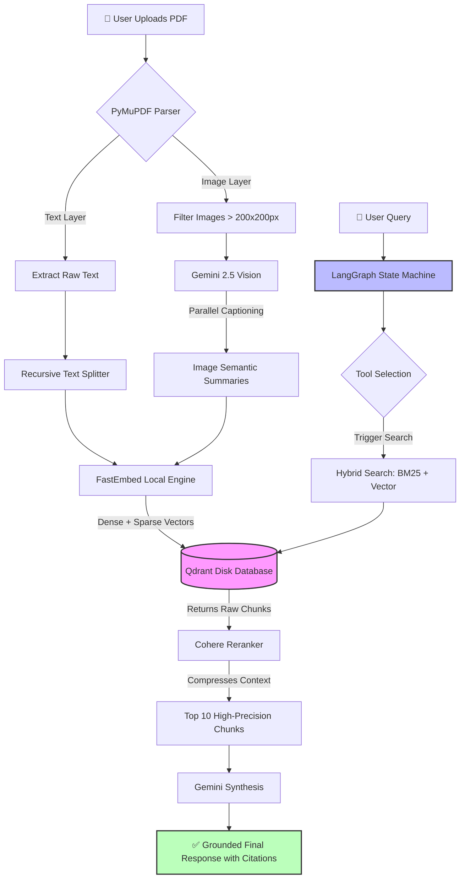

<div align="center">
  <br>
  <h1>🚀 Advanced Multimodal RAG<br>Research Assistant</h1>
  <p>
    <em>A system that actually <strong>"sees"</strong> research papers.</em><br>
    Extract text, figures, and charts using vision models, hybrid search, and agentic orchestration.
  </p>
  <br>
</div>

---

## ✨  Project Introduction

Traditional RAG systems parse PDFs as flat text strings — missing every chart, scatter plot, and diagram where the real breakthroughs live. This project fixes that with a **Multimodal RAG architecture** that extracts text, isolates figures, captions them with vision models, and indexes everything for hybrid search. 

Instead of a basic chatbot, a **LangGraph agent workflow** dynamically decides what context it needs, searches a custom hybrid database, and synthesizes answers with explicit page citations.

### 🛠️ The Tech Stack

| Category | Technology | Why We Chose It |
| :--- | :--- | :--- |
| 👁️ **LLM & Vision** | Gemini 2.5 Flash | Lightning-fast multimodal analysis for image captioning. |
| 🧠 **Orchestration** | LangGraph & LangChain | Gives our agent memory and conditional logic (ReAct loop). |
| 🧩 **Embeddings** | FastEmbed (Local) | Keeps embedding generation local to save massive API costs. |
| 🗄️ **Vector DB** | Qdrant (Disk-Backed) | Native Hybrid Search without blowing up system RAM. |
| 🎯 **Reranking** | Cohere | Trims search results to prevent LLM hallucinations. |
| 📄 **Parsing** | PyMuPDF (`fitz`) & PIL | C-based, fast PDF binary parsing and pixel filtering. |

---

## 🏗️  High-Level Architecture

* 🔧 **Ingestion Engine:** Rips PDFs apart, separates images from text, captions figures with vision models, and creates mathematical vectors.
* 🔍 **Search Engine:** Takes a question, searches for exact keywords and conceptual semantics simultaneously, then reranks the best matches.
* 🤖 **The Brain (Agent):** Evaluates the user prompt, decides which database to search, reads the results, and synthesizes a grounded answer with page citations.



---

## 🗺️  End-to-End Pipeline Walkthrough

| Step | Action | What happens under the hood? |
| :---: | :--- | :--- |
| **1** | **Upload** | Opens file stream, calculates total page count. |
| **2** | **Text Rip** | PyMuPDF strips layout, grabs raw UTF-8 strings. |
| **3** | **Image Rip** | Hunts for XREF objects, extracts raw image bytes. |
| **4** | **Junk Filter** | PIL removes any image smaller than 200×200px. |
| **5** | **Parallel Vision** | Gemini 2.5 captions every image simultaneously. |
| **6** | **Chunking** | Text sliced into overlapping paragraphs; captions kept whole. |
| **7** | **Embedding** | Local models translate text into Dense + Sparse vectors. |
| **8** | **Indexing** | Batches of 16 chunks pushed to Qdrant on disk. |
| **9** | **User Query** | Question triggers the LangGraph agent state machine. |
| **10** | **Hybrid Search** | Qdrant searches BM25 keywords + concept vectors. |
| **11** | **Reranking** | Cohere deletes irrelevant chunks, keeps top 10. |
| **12** | **Synthesis** | Gemini writes a grounded answer with page citations. |

---

## 🧩 Deep Dive: Component Engineering

* 📄 **PyMuPDF (`fitz`) & PIL:** A C-based library for reading PDF binaries — wildly faster than OCR because it reads the underlying code directly, not a pixel screenshot of text. 
* ⚡ **ThreadPoolExecutor:** Runs all image caption requests simultaneously instead of one-by-one. Requires custom `Exponential Backoff` logic to gracefully handle 429 rate-limit errors.
* 🗄️ **Qdrant & FastEmbed (Local DB):** Migrated from ChromaDB in-memory after large PDFs triggered Linux OOM Kills. Setting `path="./qdrant_db"` writes directly to disk, giving 100% stability.
* 💾 **LangGraph `MemorySaver`:** A checkpointing system that gives the agent persistent memory across turns via a `thread_id`.

---

## 👁️  The Multimodal RAG Philosophy

Standard RAG is blind to visuals. If a "semiconductor yield trend" only exists as a scatter plot on page 4, the LLM either hallucinates or gives up. 

We fix this by using Gemini Vision as a **pre-processing analyst** — it generates a dense academic caption starting with `[Visual Figure Summary]:` that is indexed alongside the text. The agent retrieves the image's description as if it were written prose.

> 💡 **Future Roadmap:** Image-to-text is a powerful hack today. The future is **Native Multimodal Embeddings** (like ColPali) — turning raw image pixels directly into vectors, skipping the text translation step entirely.

---

## 🔍  Hybrid Retrieval Architecture

Both searches run in parallel inside Qdrant. **Reciprocal Rank Fusion (RRF)** merges them into one unified ranked list.

* 🧠 **Dense (BGE-Base):** Understands Concepts & Intent. Recognizes that "temperature drop" means the same as "cooling."
* 🎯 **Sparse (SPLADE / BM25):** Hunts for Exact Keywords, specific jargon, serial numbers, and acronyms (e.g., "RTX-4090 benchmark").

---

## 🤖  Agent Orchestration (LangGraph)

A graph state machine runs a **ReAct (Reasoning + Acting)** loop — not a simple linear chain.

1. **Thought:** The LLM decides: *"I need to search the Einstein paper for this."*
2. **Action:** Triggers the `StructuredTool` we built for database queries.
3. **Observation:** The graph routes to the database, runs hybrid search, and returns raw chunks.
4. **Answer:** Graph routes back to the LLM, feeds the retrieved context, and the LLM writes the final grounded response.

---

## ✂️  Chunking Strategy

* **15–20% Overlap:** Concepts that bridge two pages are preserved. The LLM always sees the complete thought, never a truncated one.
* **Golden Rule - Never Chunk Captions:** Cutting a graph's description in half destroys the math. Image summaries bypass the splitter entirely.

---

## 🏷️ Metadata Design

Every chunk carries a JSON "sticky note" so Gemini can cite exactly where it found each answer — the ultimate hallucination defense.

```json
{
  "source": "Einstein_Relativity.pdf",
  "page": "Page 4",
  "type": "image"
}
```

---

## ⚖️  Challenges & Engineering Tradeoffs

* 💾 **RAM vs. Disk Battle:** In-memory vectors crash laptops (OOM Kills). Writing to Qdrant on disk costs ~2ms of latency but delivers 100% stability on consumer hardware.
* ⏱️ **Latency vs. Accuracy:** The Cohere Reranker adds ~800ms of wait time, but the payoff is dramatic: garbage context is deleted before the LLM ever sees it, slashing hallucinations.

---

## 🔬  Evaluation (RAGAS)

* 🎯 **Context Precision:** Validates that the Cohere reranker pushed the most relevant chunks to the very top of the results list.
* 🛡️ **Faithfulness:** Every factual claim traced back to PDF metadata (page, source). Zero-tolerance policy for hallucinations.

---

## 💻  Quickstart & Installation Guide

Ready to build? Setup your environment, configure API keys, and bypass system memory limits with our quickstart guide.

👉 **[View the Quickstart & Installation Guide](./quickstart.md)**

---

<br>
<hr size="4" color="#e0dff0">
<br>

<div align="center">
  <h2>📄 Stop reading papers. Start understanding them.</h2>
  <p><em>Give your AI visual memory — and let every chart, figure, and table speak for itself.</em></p>
</div>
<br>